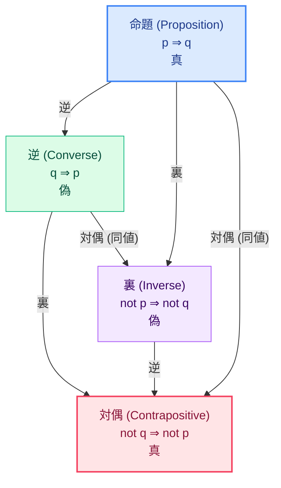

---
format:
  html:
    theme: cosmo
    toc: true
    css: styles.css
---

# Logic Basic 公式マニュアル

## アプリの目的と概要 (Overview)
**Logic Basic** は、論理学の基礎である「命題（Proposition）」と、それから派生する「逆（Converse）・裏（Inverse）・対偶（Contrapositive）」の概念を直感的に学習するためのインタラクティブなWebアプリです。
単なる公式の丸暗記ではなく、「なぜそういう名前がついているのか（語源）」と「具体的な例を通して真偽がどうなるのか」を紐付けて理解できる設計になっています。数学やプログラミングを学ぶ上での強固な論理的思考の土台を提供します。

## 主な機能と特徴 (Key Features)

| 機能名 | 概要 | ユーザーへのメリット |
| :--- | :--- | :--- |
| **語源（Etymology）カード** | 命題、逆、裏、対偶の英語名とその語源・由来を解説したカード群。 | 用語をただ暗記するのではなく、ニュアンスを含めた「納得感」のある記憶として定着させます。 |
| **インタラクティブ関係図** | 4つのノードと接続線で構成された動的な相関図。クリックで選択状態が切り替わります。 | 「逆」「裏」「対偶」の相互関係を視覚的かつ空間的に把握できます。 |
| **動的真偽判定パネル** | 図で選択したノードの「具体例」「解説」「真偽判定（True/False）」をダイナミックに表示します。 | 抽象的な記号（$p \Rightarrow q$）を「東京と日本」という具体的なスケールで直感的に理解できます。 |
| **ダークモード対応** | Lichess風の洗練されたダークテーマとライトテーマをシームレスに切り替え可能。 | 長時間の学習でも目の負担を軽減し、集中力を維持できます。 |

## 背後にある学習ロジック (Learning Logic)

本アプリの最大の狙いは、論理学で最も重要かつ強力なルールである**「対偶の法則（元の命題と対偶は真偽が一致する）」**を体感させることです。

> [!IMPORTANT]
> **The Golden Rule（同値関係）**
> 命題（p ⇒ q）と対偶（not q ⇒ not p）は「同値」です。アプリ内の関係図を操作し、この2つが必ず同じ真偽値（例では共に「真」）になることを確認してください。直接証明が難しい問題では、対偶を証明する手法（対偶証明法）が数学の基本テクニックとなります。

## 使い方ガイド (Usage Guide)

### 1. 基礎語彙のインプット
まずは画面上部の「1. 基礎語彙と語源」セクションを読み進めてください。
各カードの下部にある `Tips: 語源・由来` アラートを読むことで、英単語の成り立ちから概念をより深く理解できます。

### 2. ダイアグラムの操作と具体例の確認
1. 「2. 関係図と具体例」セクションの中央にある4つのボックス（命題・逆・裏・対偶）のいずれかをクリックします。
2. 選択されたボックスがハイライトされ、すぐ下の「詳細パネル」の内容が瞬時に切り替わります。
3. 詳細パネルにて、以下の3点を確認します：
   - **具体例**: （例: 「東京にいる ならば 日本にいる」）
   - **真偽値**: ✅ 真 (True) または ❌ 偽 (False)
   - **解説**: なぜその真偽になるのかの詳細な理由

> [!TIP]
> **学習のコツ**
> 命題の例が「真」であるとき、なぜ「逆」や「裏」は「偽」になってしまうのか？ 具体例を読みながら自分なりに反例（例：大阪にいるかもしれないから等）を想像すると、論理的思考力が飛躍的に向上します。

### 3. テーマの切り替え
- 画面右上に固定表示されている `太陽/月` アイコンのボタンをクリックすると、ライトモードとダークモードが切り替わります。学習環境に合わせて活用してください。
