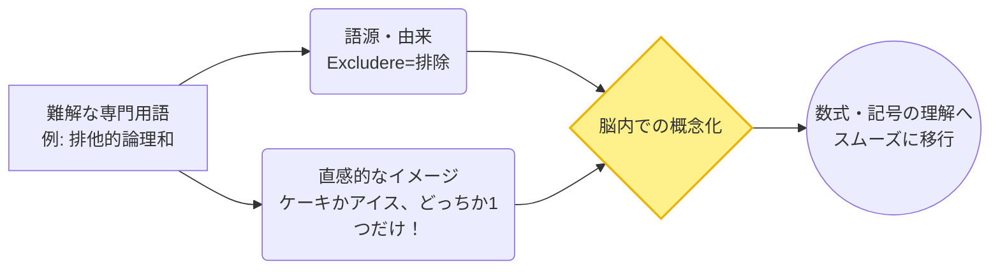

---
format:
  html:
    theme: cosmo
    toc: true
    css: styles.css
---

# Logic Terminology 公式マニュアル

## アプリの目的と概要 (Overview)
**Logic Terminology (論理学＆集合論 重要用語200 BAM! 学習ノート)** は、論理学や集合論に登場する難解な専門用語を、堅苦しい数式を排除して「直感的なイメージ」で理解するための用語リファレンスです。
「天才エデュケーター」の視点から書かれたフランクでパワフルな解説（BAM!スタイル）により、初学者がつまずきがちな抽象的な概念を、日常的な例えや比喩を用いて一気に腑に落とすことを目的としています。

## 主な機能と特徴 (Key Features)

| 機能名 | 概要 | ユーザーへのメリット |
| :--- | :--- | :--- |
| **直感的解説（BAM!スタイル）** | 「要するにどういうこと？」に答える直感的なイメージ解説を収録。 | 抽象的な数学用語の「本質」を、日常言語で手っ取り早く掴むことができます。 |
| **語源・由来の併記** | 英単語の語源（ラテン語やギリシャ語）や、提唱した歴史的人物を併記。 | 「なぜこの名前なのか」という背景知識と紐付けることで、暗記の効率を高めます。 |
| **カテゴリ別カラーリング** | 用語を5つの大カテゴリに分類し、テーマカラーで視覚的に区別。 | 自分が今、論理学や集合論のどの分野（命題論理、述語論理、集合、関係など）を学んでいるかを見失いません。 |
| **印刷最適化レイアウト** | `@media print` CSSを用いて、紙の資料やPDFとして出力するのに最適なレイアウトを実現。 | ブラウザで読むだけでなく、印刷して物理的な暗記ノートやチートシートとして活用できます。 |

## 背後にある学習ロジック (Learning Logic)

数学的な厳密な定義（記号論理）に入る前に、**「概念のゲシュタルト（全体的なイメージ）」**を形成することを最優先としています。

> [!NOTE]
> **抽象概念の具体化**
> 人間の脳は、馴染みのない記号の羅列を記憶するのが苦手です。本アプリは、論理結合子や量化子を「スイッチ」や「魔法」といった具体的な比喩に変換することで、認知の摩擦を減らします。

## 使い方ガイド (Usage Guide)

### 1. 学習の進め方
本ノートは、論理学・集合論の学習における「副読本」として活用するのが最適です。
教科書や授業で知らない用語（例：「全称量化子」や「冪集合」）が出てきたら、本アプリを開いて該当用語をスクロールして探します。

### 2. カテゴリの構造
用語は論理的な順序でカテゴリ化されています。上から順に読むことで、基礎から発展へと自然に理解が深まります。
- **1. 命題論理と論理結合子**: 論理の基礎（AND, OR, NOT）
- **2. 述語論理と量化子**: 「すべて」や「存在する」という概念
- **3. 集合論の基礎**: グループ分けのルール
- **4. 関係と関数**: 要素同士の結びつき
- **5. 証明の手法と推論規則**: 正しさを証明するための武器

### 3. チェックリストの活用
- 語句の横にあるチェックボックス欄 `☐` は、印刷時に進捗管理として利用できるよう設計されています。
- ブラウザの印刷機能（`Ctrl+P` または `Cmd+P`）を使用してPDF化するか、紙に印刷してください。学習済みの用語にチェックを入れることで達成感を得られます。

> [!TIP]
> **「語源」を制する者は論理学を制す**
> 例えば `Tautology（トートロジー）` という言葉は、ギリシャ語の tauto（同じ）+ logos（言葉）が語源です。これを「同じことを繰り返す＝絶対に真になる言葉」と紐付けることで、忘却を防ぐことができます。「語源・由来」カラムは飛ばさずに必ず目を通してください！
