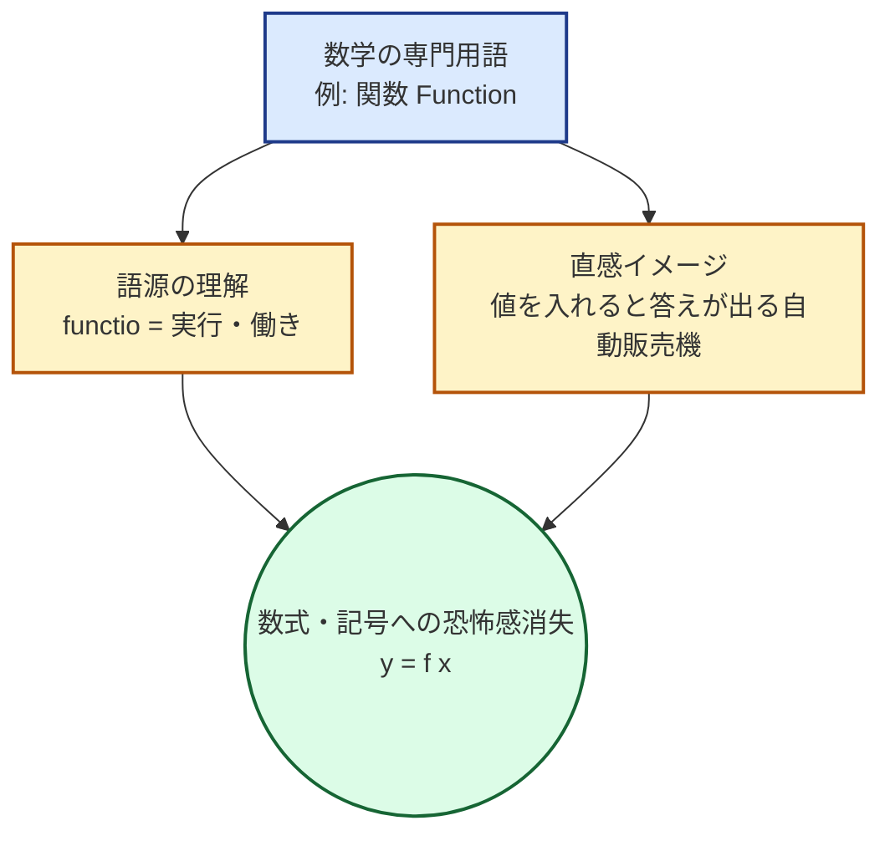

---
format:
  html:
    theme: cosmo
    toc: true
    css: styles.css
---

# Math Terminology 公式マニュアル

## アプリの目的と概要 (Overview)
**Math Terminology (初歩からの数学 直感的学習ノート)** は、数学の基礎から微積分までの重要用語（全200語）を網羅したリファレンスアプリです。
数学の学習において最大の壁となる「数式の丸暗記」や「無味乾燥な定義」を捨て、言葉のルーツ（語源）と「要するにどういうこと？」という直感的なイメージに翻訳することで、数学的思考の土台を直感的に脳に焼き付けることを目的としています。

## 主な機能と特徴 (Key Features)

| 機能名 | 概要 | ユーザーへのメリット |
| :--- | :--- | :--- |
| **直感翻訳（要するに？）** | 厳密な数学的定義を、「ピザの切り分け」や「自動販売機」など日常的な比喩に翻訳したカラムを提供。 | 数式アレルギーを起こすことなく、概念の「本質的な意味」を即座に掴むことができます。 |
| **語源・由来解説** | ラテン語やギリシャ語の語源、ピタゴラスやデカルトなど考案した歴史的人物のエピソードを収録。 | なぜその用語が生まれたのかという「ストーリー」とともに記憶に定着させます。 |
| **6つの学習カテゴリ** | 数の概念、方程式、関数、指数・対数、場合の数、極限・微積分など6つの章に分類。 | 基礎から応用まで、体系的かつステップ・バイ・ステップで学習を進められます。 |
| **印刷対応（Print-friendly）** | 印刷時に見出しや表が最適化される専用のCSSスタイルを適用。 | 印刷して持ち歩くチートシートや、暗記用ノートとしてオフラインでも活用可能です。 |

## 背後にある学習ロジック (Learning Logic)

数学は「記号の言語」ですが、初学者がいきなり記号から入ると挫折（Symbol Shock）を引き起こします。
本アプリは以下のプロセスで学習者の理解をサポートします。

> [!NOTE]
> **抽象から具体への翻訳**
> 極限や微積分などの高度な概念も、「限りなく近づける」「チリやホコリ」といった具体的な言葉に置き換えることで、脳内でのイメージ化（可視化）を強力に推進します。

## 使い方ガイド (Usage Guide)

### 1. 授業や独学の「辞書」としての活用
数学の教科書を読んでいて、定義が頭に入ってこない時（例：「漸化式」や「逆関数」など）に、本アプリを開いて該当用語を探してください。
「直感的なイメージ」の列を読むことで、数式の意味がスッと腑に落ちるはずです。

### 2. カテゴリごとの全体像の把握
カテゴリ（第1章から第6章）は、数学の歴史的・理論的な発展順に並んでいます。
- **第1章（数の概念）** から **第2章（方程式）** へ進むことで、「数」が「未知数を探すゲーム」へと発展する流れを体感してください。
- 各章のテーマカラー（青、緑、赤など）を目印に、現在学習している分野のマッピングを行います。

> [!TIP]
> **英語名 (English) カラムの活用**
> プログラミングや海外の論文を読む際、数学用語の英語名（例: Integer, Array, Derivative）は必須の知識となります。日本語と英語をセットで眺める癖をつけることで、将来的な学習の幅が大きく広がります。
