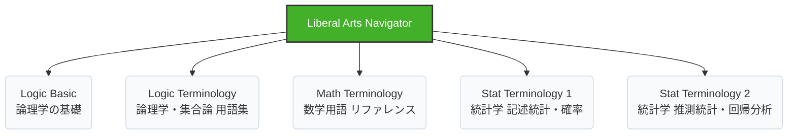

---
format:
  html:
    theme: cosmo
    toc: true
    css: styles.css
---

# Liberal Arts Navigator 公式マニュアル

## アプリの目的と概要 (Overview)
**Liberal Arts Navigator**は、論理学・数学・統計学などのリベラルアーツ学習モジュール群を統合的に管理・起動するためのポータルダッシュボードです。
分散しがちな学習用アプリを一つのインターフェースに集約し、学習者が迷うことなく目的の学習コンテンツ（Logic, Math, Statistics 等）へシームレスにアクセスできる環境を提供します。洗練されたUIにより、毎日の学習開始のハードルを下げ、モチベーションの維持をサポートします。

## 主な機能と特徴 (Key Features)

| 機能名 | 概要 | ユーザーへのメリット |
| :--- | :--- | :--- |
| **統合ダッシュボード** | 全ての学習アプリ（全5種）をカード型UIで一覧表示します。 | 目的のアプリを視覚的に素早く探し出し、ワンクリックで起動できます。 |
| **レスポンシブデザイン** | PC、タブレット、スマートフォンなど、あらゆる画面サイズに最適化されています。 | デバイスを問わず、快適なナビゲーション体験を提供します。 |
| **環境（Environment）切替** | ヘッダーのセレクトボックスから、対象とするリポジトリ環境を切り替え可能です（現在 `liberal_arts (base)` 対応）。 | 複数の学習リポジトリやバージョンを管理する際の手間を削減します。 |
| **バージョン・説明の明示** | 各アプリのバージョン情報と、直感的な概要（Description）をカード内に表示。 | そのモジュールで「何を学べるか」を起動前に正確に把握できます。 |

## 背後にある学習ロジック (Learning Logic)

本アプリは、学習前の**「認知負荷（Cognitive Load）の削減」**を目的として設計されています。
複数のURLを管理する手間を省き、以下のようなハブとして機能します。

> [!NOTE]
> **学習の一元化**
> 異なるジャンルの学習を一つのポータルから開始することで、分野を横断した「リベラルアーツ」としての総合的な学びの意識を自然と醸成します。

## 使い方ガイド (Usage Guide)

### 1. アプリケーションの起動
1. 画面中央のグリッド上に並んだ各アプリケーションのカードを確認します。
2. 学びたいモジュールのカード内にある緑色の **[Launch]** ボタンをクリックします。
3. アプリケーションが新しいタブで起動し、すぐに学習を開始できます。

### 2. 環境（Environment）の確認
- 画面上部のヘッダーバーにある「Environment:」のドロップダウンを確認してください。
- デフォルトでは `liberal_arts (base)` が選択されています。将来的に複数の学習セットが提供された場合は、ここから切り替えが可能です。

### 3. モジュールの詳細設定（Settings）
- 各カードの [Launch] ボタンの右側にある **歯車（Settings）アイコン** をクリックすることで、モジュール個別の設定や情報にアクセスできます。（※将来の拡張機能として予約されています）

> [!TIP]
> **日々の学習ルーティン化**
> この `navi.html` をブラウザのブックマークバーやスタートページに登録しておくことを強くお勧めします。1クリックで全教材へアクセスできるため、学習の習慣化に大きく貢献します。
