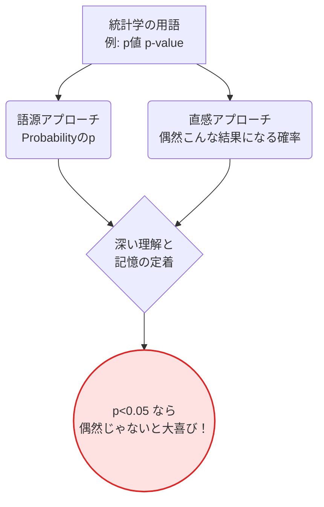

---
format:
  html:
    theme: cosmo
    toc: true
    css: styles.css
---

# Stat Terminology 2 (完全版) 公式マニュアル

## アプリの目的と概要 (Overview)
**Stat Terminology 2 (統計学用語 語源＆直感ノート 完全版)** は、「Stat Terminology 1」をベースに、学習の定着率を劇的に引き上げるための**直感的解説（StatQuest風ひとことイメージ）**を追加した究極の統計学用語リファレンスです。
数式や厳密な定義に押しつぶされそうな学習者を救うため、「要するにこういうこと！」というパンチの効いた比喩や解説を採用。カテゴリ別の美しいカラーリングと相まって、統計学を「楽しく、直感的に」マスターするための最強のツールとなっています。

## 主な機能と特徴 (Key Features)

| 機能名 | 概要 | ユーザーへのメリット |
| :--- | :--- | :--- |
| **StatQuest風ひとこと解説** | 「要するにどういうこと？」を、ユーモアを交えた分かりやすい比喩でズバリ解説。 | 難解な統計コンセプトを、瞬時に脳内で視覚化・イメージ化できます。 |
| **進捗管理チェックボックス** | 各用語の先頭に `☐` を配置。 | 印刷して学習する際、覚えた用語にチェックを入れ、自分の成長を可視化できます。 |
| **フルカラーのカテゴリ分類** | 記述統計（青）、確率（緑）、検定（赤）など、6つの分野を鮮やかなテーマカラーで色分け。 | 大量の用語の中でも迷子にならず、自分がどの領域を学んでいるか常に把握できます。 |
| **語源と直感のデュアルアプローチ** | 「語源・由来」による論理的理解と、「ひとこと解説」による直感的理解を両立した4カラム構成。 | 左脳（論理）と右脳（イメージ）の両方を刺激し、強固な記憶定着を実現します。 |

## 背後にある学習ロジック (Learning Logic)

統計学の学習において、最も効果的なのは「学術的な厳密さ」と「大雑把なイメージ」の橋渡しをすることです。本アプリは、この2つのギャップを埋めるインターフェースとして機能します。

> [!IMPORTANT]
> **「厳密さ」よりも「イメージ」を優先**
> 初学者が統計学で挫折する原因の9割は「イメージが湧かないこと」です。本マニュアルの「StatQuest風ひとこと」は、あえて厳密性を少し犠牲にしてでも、強烈なイメージを脳に焼き付けるように設計されています。

## 使い方ガイド (Usage Guide)

### 1. ひとこと解説（イメージ）からの逆引き学習
通常の辞書とは逆に、まずは右端の **「StatQuest風ひとこと (イメージ)」** の列を流し読みしてみてください。
「酔っぱらいの千鳥足」や「あわてんぼうの誤り」といった面白いフレーズを見つけたら、それがどの専門用語（ランダムウォーク、第1種の過誤など）を指しているかを確認します。この逆引き学習が、知的好奇心を刺激します。

### 2. 検定手法の選び方ガイドとして
第3章の「推測統計と仮説検定」セクションは、データ分析の実務で「どの検定を使えばいいか？」迷ったときのフローチャート代わりに使えます。
- 例：「正規分布を諦めた時は？」→ `クラスカル・ウォリス検定` や `マン・ホイットニーのU検定` の直感解説を確認する。

### 3. プリントアウトしての暗記
1. ブラウザの機能でこのページをPDFとして保存、または印刷します。
2. 勉強が進むごとに、左端のチェックボックス `☐` にペンでチェックを入れていきます。
3. 210語すべてにチェックが入る頃には、あなたはデータサイエンスの基礎的な議論に堂々と参加できるレベルに到達しているはずです！

> [!TIP]
> **類似用語の違いを比較する**
> 「大数の弱法則」と「大数の強法則」や、「リッジ回帰」と「ラッソ回帰」など、似たような用語が並んでいる箇所は、右端の「ひとことイメージ」を比較することで、その違い（例：係数を小さくするだけか、完全にゼロにするか）が一目瞭然になります。
