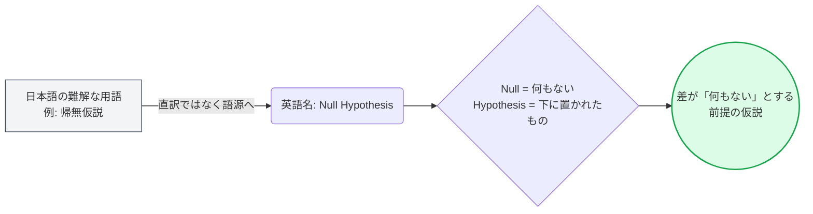

---
format:
  html:
    theme: cosmo
    toc: true
    css: styles.css
---

# Stat Terminology 1 公式マニュアル

## アプリの目的と概要 (Overview)
**Stat Terminology 1 (統計学用語 語源ノート)** は、統計学・機械学習における必須用語（約210語）を網羅した基礎的な用語集アプリです。
このバージョンは、特に「英語名」と「語源・由来」に特化しており、専門用語が持つ本来のニュアンスを深く理解するための辞書として機能します。シンプルなテーブル構成により、無駄を削ぎ落としたストイックな学習体験を提供します。

## 主な機能と特徴 (Key Features)

| 機能名 | 概要 | ユーザーへのメリット |
| :--- | :--- | :--- |
| **日・英・語源の対比表** | 日本語名、英語名、その語源（ラテン語・ギリシャ語など）を並べたシンプルな3カラム構成。 | 統計学の用語が「なぜそう呼ばれるのか」を言語学的なアプローチで理解できます。 |
| **6つの専門分野カバー** | 記述統計から、確率、仮説検定、回帰分析、実験計画法、ベイズ統計まで網羅。 | 統計学の全体像を俯瞰し、必要な分野の用語を辞書的に素早く検索できます。 |
| **軽量でシンプルなUI** | 装飾を最小限に抑えたモノクローム調のデザイン。 | 読み込みが速く、情報をノイズなしにストレートにインプットできます。 |

## 背後にある学習ロジック (Learning Logic)

統計学の用語（特に日本語訳）は、「帰無仮説」や「分散分析」など、漢字の羅列による難解さが学習の障壁となります。
本アプリは**「語源ベース学習法（Etymology-based Learning）」**を採用しています。

> [!NOTE]
> **なぜ語源が重要なのか？**
> 「分散 (Variance)」が「Variare (変わる)」から来ていることを知れば、それが「データの散らばり（変化）具合」を表していることが自然と理解できます。用語の丸暗記を論理的な理解へと転換します。

## 使い方ガイド (Usage Guide)

### 1. リファレンスとしての利用
- データ分析や統計学のテキストを読んでいる際、知らない用語が出てきたら本アプリを参照してください。
- 表の `語源・由来` 列を読むことで、その用語が元々どのようなニュアンスを持って名付けられたのかを確認します。

### 2. 英語論文・プログラミングへの応用
- 統計モデリングをPythonやRで行う際、関数名はすべて英語（例: `Variance` -> `var()`, `Standard Deviation` -> `std()`）です。
- 本アプリの `英語` 列を活用し、日本語の概念と英語の関数名を結びつけて記憶することで、コーディング時の効率が大幅に向上します。

> [!TIP]
> **より深い理解を求める方へ**
> この「Stat Terminology 1」は語源に特化したストイックな構成です。もし、「もっと直感的なイメージや比喩で教えてほしい！」と感じた場合は、上位バージョンである **「Stat Terminology 2 (完全版)」** の利用を強くお勧めします。
